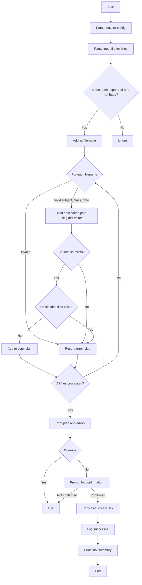

# Plan for `utils/distribute_transcripts.py`

## Overview

This CLI app distributes transcript files into a structured folder hierarchy based on subject, class type, and date, as specified in an input file and `.env`. It supports a dry-run mode, robust error handling, and optional logging to a file.

---

## 1. Parse Configuration

- Read `.env` to extract:
  - `DESTINATIONS_LEVEL_1` (subject → folder name, e.g., "linear-algebra" → "./LA")
  - `DESTINATIONS_LEVEL_2` (class type → subfolder name, e.g., "tutorial" → "tutorials")
  - `LOCAL_TRANSCRIPT_OUTPUT_DIR` (source directory for transcripts)

**Important:**  
The actual names of the destination folders are determined by looking up the subject and class type in the `DESTINATIONS_LEVEL_1` and `DESTINATIONS_LEVEL_2` dictionaries, NOT by simply using the corresponding segments from the filename. The filename is only used to extract the keys for these lookups.

---

## 2. Parse Input

- The input file is a required positional argument:  
  `python utils/distribute_transcripts.py input.txt`
- Read the specified input file line by line.
- For each line:
  - If the line is a dash-separated string and does **not** begin with `https://`, treat it as a potential filename.
  - Filenames will always occupy a whole line, never embedded within other text.
  - Filenames may appear on subsequent lines without a link between them.
  - Ignore all other lines, including any line that begins with `https://`.

---

## 3. Analyze Filenames

- For each filename:
  - Identify the subject (level 1) by matching the longest prefix from `DESTINATIONS_LEVEL_1`.
  - Identify the class type (level 2) by matching the next segment from `DESTINATIONS_LEVEL_2`.
  - Extract the date (level 3) and validate it matches `DD-MM-YY`.
  - **Use the values from the dictionaries for the destination path, not the raw segments from the filename.**
  - If any part fails, record the error and skip the file.

---

## 4. Build Plan

- For each valid filename:
  - Construct the destination path:  
    `[DESTINATIONS_LEVEL_1 value]/[DESTINATIONS_LEVEL_2 value]/[date]/`
  - Determine the source `.txt` file path.
  - Check if the source file exists.
  - Check if the destination `.txt` or `.tex` file already exists.
  - If any check fails, record the error and skip the file.

---

## 5. Present Plan

- Print a summary table:
  - Files to be copied (source → destination)
  - Files that will be skipped (with reasons)
- If not in dry-run mode, prompt the user for confirmation to proceed.

---

## 6. Execute Plan

- For each file to be copied:
  - Create the destination directory if it does not exist.
  - Copy the `.txt` file.
  - Create an empty `.tex` file.
  - Log each successful operation.

---

## 7. Final Summary

- Print a summary of:
  - Successfully copied files
  - Files skipped (with error reasons)

---

## 8. CLI Arguments

- The input file is a required positional argument.
- Support a `--dry-run` flag to only print the plan without making changes.
- Support a `--log-file` option to write the full log and summary to a specified file for later review.

---

## Error Handling

**The script will skip files and log the following error cases:**

1. **Invalid Filename Format:**  
   - The line is not a dash-separated string or is malformed.  
   - **Note:** Lines that begin with `https://` are ignored and NOT reported as errors.
2. **Subject Not Found:**  
   - No matching key in `DESTINATIONS_LEVEL_1`.
3. **Class Type Not Found:**  
   - No matching key in `DESTINATIONS_LEVEL_2`.
4. **Invalid Date Format:**  
   - The date segment does not match `DD-MM-YY`.
5. **Source Transcript File Missing:**  
   - The `.txt` file does not exist in the transcript source directory.
6. **Destination File Already Exists:**  
   - Either the `.txt` or `.tex` file already exists in the destination directory.
7. **Other I/O Errors:**  
   - Any unexpected error during directory creation or file copying.

Each error will be reported with the filename and a clear reason in the final summary.

---

## Mermaid Flowchart



---

## CLI Usage Example

```bash
python utils/distribute_transcripts.py input.txt --dry-run
python utils/distribute_transcripts.py input.txt --log-file distribute_log.txt